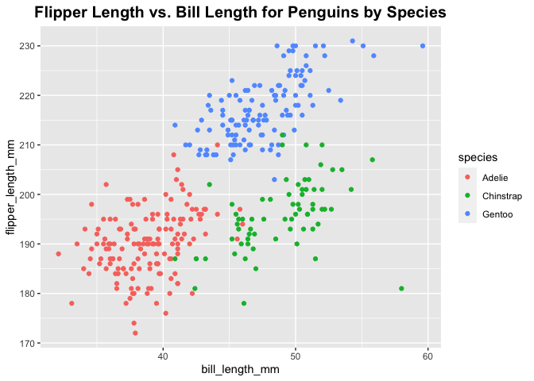

p8105\_hw1\_yw3774
================
Yida Wang
9/22/2021

``` r
library(tidyverse)
```

    ## ── Attaching packages ─────────────────────────────────────── tidyverse 1.3.1 ──

    ## ✓ ggplot2 3.3.5     ✓ purrr   0.3.4
    ## ✓ tibble  3.1.4     ✓ dplyr   1.0.7
    ## ✓ tidyr   1.1.3     ✓ stringr 1.4.0
    ## ✓ readr   2.0.1     ✓ forcats 0.5.1

    ## ── Conflicts ────────────────────────────────────────── tidyverse_conflicts() ──
    ## x dplyr::filter() masks stats::filter()
    ## x dplyr::lag()    masks stats::lag()

## Promble 1

Create a data frame comprised of:  
1. a random sample of size 10 from a standard Normal distribution  
2. a logical vector indicating whether elements of the sample are
greater than 0  
3. a character vector of length 10  
4. a factor vector of length 10, with 3 different factor “levels”

``` r
df_prob1 = tibble(
  samp = rnorm(10),
  vec_logical = samp > 0,
  vec_char = c("a", "b", "c", "d", "e", "f", "g", "h", "i", "j"),
  vec_factor = factor(c("low", "low", "low", "mid", "mid", "mid", "high", "high", "high", "high"))
  )
```

-   Take the mean of each variable in my dataframe.What works and what
    doesn’t?

``` r
mean(pull(df_prob1, samp))
```

    ## [1] 0.1769023

``` r
mean(pull(df_prob1, vec_logical))
```

    ## [1] 0.7

``` r
mean(pull(df_prob1, vec_char))
```

    ## Warning in mean.default(pull(df_prob1, vec_char)): argument is not numeric or
    ## logical: returning NA

    ## [1] NA

``` r
mean(pull(df_prob1, vec_factor))
```

    ## Warning in mean.default(pull(df_prob1, vec_factor)): argument is not numeric or
    ## logical: returning NA

    ## [1] NA

The mean of numbers and logical work but character or factor don’t.

------------------------------------------------------------------------

-   Write a code chunk that applies the as.numeric function to the
    logical, character, and factor variables (please show this chunk but
    not the output). What happens, and why? Does this help explain what
    happens when you try to take the mean?

This code chunk below applies the *as.numeric* function to the logical,
character, and factor variables.

``` r
as.numeric(pull(df_prob1, vec_logical))
as.numeric(pull(df_prob1, vec_char))
as.numeric(pull(df_prob1, vec_factor))
```

The *as.numeric* function turned the logical variables into type
“numeric” and logical values `FALSE` and `TRUE` are turned into `0` and
`1`, respectively.  
Character variables are all coerced to `NA`.  
Factor objects are turned to numbers indicating their different levels.
“low”-&gt;2, “high”-&gt;1, “mid”-&gt;3.

When we taking *mean()* function, only the logical variable and numeric
variable works.  
R consider `FALSE` and `TRUE` as `0` and `1`, so this is same as the
numeric variable. The character variables can not be consider as numeric
variable or coerced to numeric type by the *as.numeric* function. So
*mean()* function didn"t work.

# Problem 2

Loads the \*Penguins\*\* dataset from the *palmerpenguins* package.

``` r
data("penguins", package = "palmerpenguins")
```

-   Write a short description of the penguins dataset (not the
    penguins\_raw dataset) using inline R code, including:  

1.  the data in this dataset, including names / values of important
    variables  
2.  the size of the dataset (using nrow and ncol)  
3.  the mean flipper length

The **Penguins** dataset contains the following variables:
bill\_depth\_mm, bill\_length\_mm, body\_mass\_g, flipper\_length\_mm,
island, sex, species, year. The number of rows (observations datas) in
the Penguin dataset is 344. The number of columns (variables) in the
Penguin dataset is 8. Flipper Length (mm) is a integer variable. The
mean flipper length in mm is 200.9152047.

This code chunk below generates a scatter plot for bill length and
flipper length, each color represents a different species.

``` r
ggplot(penguins, aes (x = bill_length_mm, y = flipper_length_mm, color = species)) + geom_point() + ggtitle("Flipper Length vs. Bill Length for Penguins by Species") + theme(plot.title = element_text(size = 15, face = "bold", hjust = 0.5, lineheight = 1.5))
```

    ## Warning: Removed 2 rows containing missing values (geom_point).

<!-- -->

``` r
ggsave("scatterplot_penguin.pdf")
```

    ## Saving 7 x 5 in image

    ## Warning: Removed 2 rows containing missing values (geom_point).
